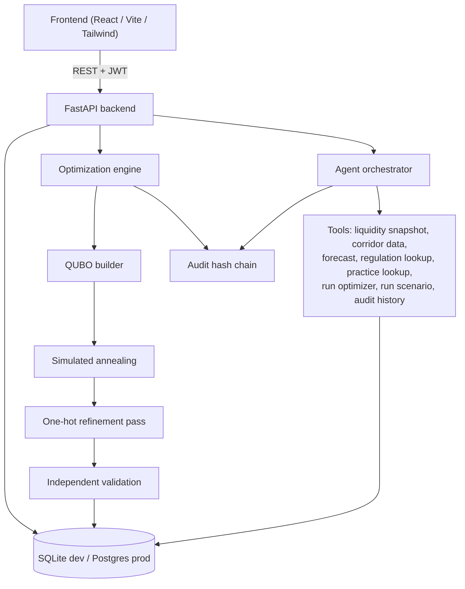
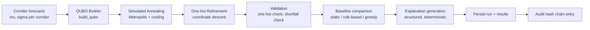
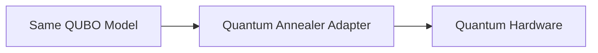
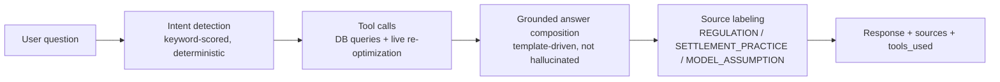
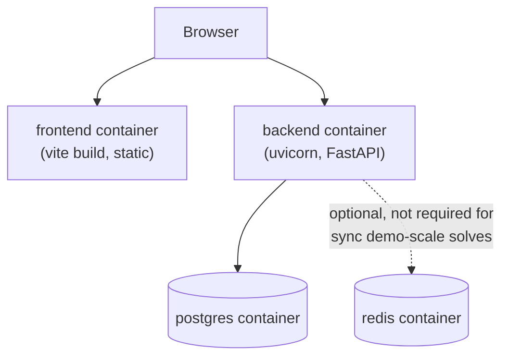

# Architecture

## System overview



## Optimization pipeline detail



Future (not implemented - see `roadmap.md`):



## Agent pipeline detail



## Solver abstraction

`OptimizationSolver` is not a literal Python interface class in this build, but the calling contract in `optimization/engine.py::run_optimization()` is deliberately solver-agnostic: it takes a `QuboModel` and returns an assignment. Swapping `simulated_annealing()` for a future `quantum_annealing_solve()` would not require touching the QUBO construction, validation, baseline comparison, or explanation generation - only the solver call itself.

```
Optimization Request -> QUBO Builder -> QUBO Model -> Solver -> Solution -> Validation -> Recommendation
                                                          |
                                              [today: SimulatedAnnealingSolver]
                                              [future: QuantumAnnealingSolver]
```

## Payment rail connector abstraction

No production payment rail integration exists in this build (nor is one claimed). The concept is documented, not implemented, in `docs/roadmap.md` - a `PaymentRailAdapter` interface with `MockPaymentRailAdapter` (what a demo would use today), `SandboxPaymentRailAdapter`, and `FutureProductionPaymentRailAdapter` as the intended evolution path.

## Data flow: request to response

1. Frontend sends `POST /api/optimization/run` with JWT bearer token.
2. `api/optimization.py::corridor_inputs_from_db` pulls corridors, computes live forecasts from transaction history, reads risk parameters and current balances.
3. `optimization/engine.py::run_optimization` builds the QUBO, runs SA, refines, validates, computes baselines, generates explanations.
4. `persist_optimization_run` writes `OptimizationRun`, `OptimizationResult`, `OptimizationBaseline` rows and appends one entry to the audit hash chain.
5. Response includes everything the frontend needs to render KPIs, the convergence chart, before/after bars, and per-corridor explanations without a second round-trip.

## Deployment topology (Docker)


