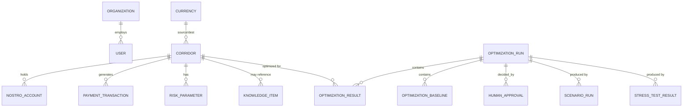

# Data Model

17 tables (`backend/app/models.py`), migrated via Alembic (`backend/alembic/versions/`). Scope note: the source spec enumerated 30+ tables; this schema covers every functional area without padding - see the README's simplifications table.

## Tables

| Table | Purpose |
|---|---|
| `organizations` | Demo bank ("Demo Global Bank") |
| `users` | Auth - one seeded demo user |
| `currencies` | 8 seeded currencies |
| `corridors` | 11 seeded corridors, with settlement window/cutoff |
| `nostro_accounts` | Current balance per corridor |
| `payment_transactions` | ~3,900 seeded synthetic transactions (90 days) |
| `payment_forecasts` | (schema present; forecasts are computed live from transactions rather than cached here in this build) |
| `risk_parameters` | Opportunity cost rate, loss-given-shortfall, FX cost, operational cost per corridor |
| `knowledge_items` | Dual-corpus knowledge base - `source_type` in `{REGULATION, SETTLEMENT_PRACTICE, MODEL_ASSUMPTION}` |
| `optimization_runs` | One row per optimization run - solver params, energies, versions, convergence history, hash chain fields |
| `optimization_results` | Per-corridor result + structured explanation JSON, one run has many |
| `optimization_baselines` | Static/rule-based/greedy/quantum-inspired comparison values |
| `scenarios` | Named scenario runs with override params, linking to the resulting `optimization_runs` row |
| `stress_test_results` | One row per scenario per stress-test batch |
| `audit_logs` | Tamper-evident hash chain - every optimization run and every approval |
| `agent_messages` | Chat history per agent session |
| `human_approvals` | Approve/reject/recalculation decisions, linked to a run |

## Notable design choices

- **`payment_forecasts` exists in the schema but forecasts are computed live** from `payment_transactions` on each request rather than cached, since the synthetic dataset is small enough (~3,900 rows) that this costs single-digit milliseconds. A production version would cache/version forecasts, which is exactly what the table is for.
- **Liquidity balances are normalized to a `_musd` (millions-USD-equivalent) convention** throughout, to allow cross-currency aggregation without a full FX-rate table - a deliberate simplification flagged in `docs/limitations.md`.
- **`optimization_runs.convergence_json`** stores a sampled (not every-iteration) energy trace, sized for the frontend's convergence chart rather than for exhaustive replay.
- **Hash chain fields (`prev_hash`, `self_hash`)** live directly on `optimization_runs` and `audit_logs` rather than a separate ledger table, since every run *is* an audit event.
